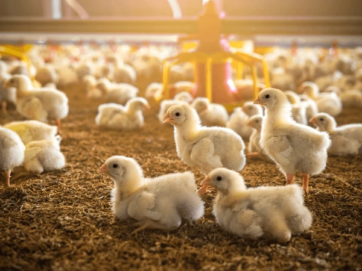

# R_script_for_Microbiome_Analysis

The script serves to process the output from Qiime2 from the litter samples from Eva/Jolie project of Dr. Hauck's lab

### ANCOMBC tutorial page
   https://www.bioconductor.org/packages/release/bioc/vignettes/ANCOMBC/inst/doc/ANCOMBC.html

<p align="center">

</p>

# Materials and methods
<ul>
<li>72 pens with X broiler chickens each</li>
<li>litter was sampled on day 20 and day 28 of the experiment and immediately stored on ice and then in -80°C</li>
<li>DNA was extracted with the Qiagen QIAamp Fast DNA Stool Mini Kit using the QIAcube connect</li>
<li>Primer 515F and 926R were used for 16S rRNA V4/5 amplification</li>
<li>Products were sent for Illumina 16S rRNA sequencing</li>
<li>Preprocessing in qiime, using Dada2 (trimming 19F/20R, truncating 240F/210R)</li>
<li>Downstream analyses in R, packages phyloseq, microbiome, vegan</li>
<li>Pathway analysis with picrust2 and Burrito</li>
</ul>

# Research questions
<ul>
<li>Are there any changes on day 20 of the experiment in the bacterial composition of the litter of broilers after administration of different water treatments compared to the control groups?</li>
<li>Are there any changes on day 28 of the experiment in the bacterial composition of the litter of broilers after administration of different water treatments or application of different soil additives compared to the control groups?</li>
<li>What are the differences and interactions of day 20 and day 28?</li> 
</ul>

# Helpful links
<a href="https://hpcdocs.asc.edu">ASC user documentation</a> <br>
https://docs.onecodex.com/en/collections/2395689-introduction-to-the-microbiome

### Preprocessing in qiime2 
<ul>
 <li>Scripts: <ul>
  <li><a href="qiime2_manifest_maker.sh">qiime2_manifest_maker.sh</a></li>
  <li><a href="qiime2.sh">preprocessing_qiime2.sh</a></li></ul>
 <li><a href="Qiime2-results">Qiime2-results:</a><ul>
  <li>table.qza, taxonomy.qza, rooted-tree.qza, rep-seqs.qza, table.biom, rep-seqs.fasta, denoising-stats.qzv</li></ul>
<li>Workflow: <ul>
 <li>upload raw data onto ASC</li>
 <li>import raw data with manifest, output file to check quality and decide trimming and truncating: demux.qza</li>
  <li>Dada2: trimming 19F/20R, truncating 240F/210R, output files: table.qza, rep_sequences.qza, denoising_stats.qza</li>
  <li>rooted phylogenic tree: rooted-tree.qza</li>
  <li>taxonomy with silva-138-99-nb-classifier.qza classifier: taxonomy.qza</li>
  <li>export of table.biom and rep_sequences.fasta for pathway analysis with picrust2</li></ul>
</ul>

### Statistical analysis and plots in R
<ul>
 <li>Script <a href="Salmonella22_microbiome.R">Salmonella22_microbiome.R</a></li>
<li>Workflow: <ul>
  <li>qiime2R: import of table.qza, rooted-tree.qza, metadata.tsv, taxonomy.qza in a phyloseq object</li>
  <li>phyloseq: filtering all non-bacteria and reads less than 5k out</li>
  <li>differential abundance: package ANCOMBC</li>
  <li>alpha diversity: Shannon, Pielou's, Observed richness, statistical test Kruskal Wallis and groupwise comparison with Tukey's post hoc test</li>
  <li>beta diversity: weighted and unweighted unifrac, Jaccard, Bray-Curtis, statistical test for location and dispersion PERMANOVA</li></ul>
</ul>

### Pathway analysis in picrust2 and edgeR (R)
<ul>
 <li>Scripts: <ul>
  <li><a href="Salmonella22_picrust2.sh">Salmonella22_picrust2.sh</a></li>
  <li><a href="Salmonella22_pathways.R">Salmonella22_pathways.R</a></li></ul>
<li>Workflow: <ul>
  <li>import of table.biom, (rooted-tree.nwk), rep-seqs.qza in picrust2</li>
  <li>generating picrust2 output</li>
  <li>import table to R and statistical tests and mapping to GO in edgeR</li>
  <li>visualization with GOplot and ggplot2</li></ul>
</ul>

### RESULTS for genus and phylum level
<ul>
 <li>Preprocessing:<ul>
  <li>counts for 5k filtering:</li>
  <li>counts for 10k filtering:</li>
  <li>counts for 10k filtering:</li>
  <li>counts for 20k filtering:</li></ul>
<li>Differential abundance, phylum not possible bc only 5 taxa error:<ul>
  <li>Day 20, water treatment:</li>
  <li>Day 28, water treatment:</li>
  <li>Day 28, litter treatment:</li></ul>
<li>Alpha diversity:<ul>
  <li>Day 20, water treatment:</li><ul>
     <li>Observed, Pielou, Shannon</li></ul>
  <li>Day 28, water treatment:</li><ul>
     <li>Observed, Pielou, Shannon</li></ul>
  <li>Day 28, litter treatment:</li><ul>
     <li>Observed, Pielou, Shannon</li></ul></ul>
<li>Beta diversity:<ul>
  <li>Day 20, water treatment:</li><ul>
   <li>Bray-Curtis, Unweighted Unifrac, Weighted Unifrac</li></ul>
  <li>Day 28, water treatment:</li><ul>
   <li>Bray-Curtis, Unweighted Unifrac, Weighted Unifrac</li></ul>
  <li>Day 28, litter treatment:</li><ul>
   <li>Bray-Curtis, Unweighted Unifrac, Weighted Unifrac</li></ul></ul>
<li>Pathway analysis:</li> 
</ul>

# Helpful chunks
counts all .txt files in the directory: ```du -sh directory/*.txt | wc -l``` <br>
lists the .txt files with filesize: ```du -sh directory/*.txt``` <br>
lists running jobs in the slurm queue: ```qstat``` <br>
cancels runing jobs: ```qdel jobnumber``` <br>
info about the slurm job: ```jobinfo -j jobnumber``` <br>
give group-permission for execution to folder: ```chmod -R g+x foldername``` or ```chmod -R 777 foldername```
